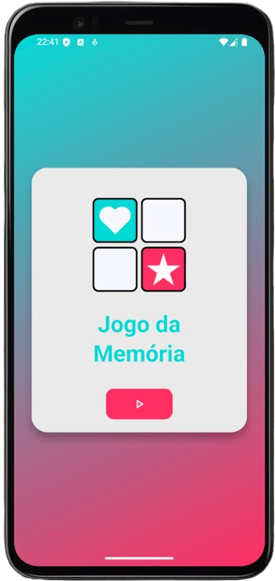
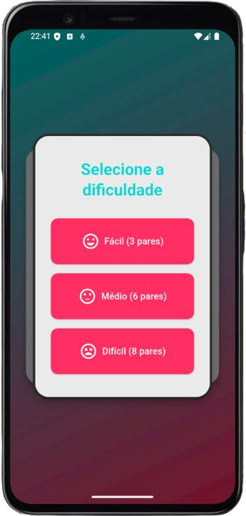
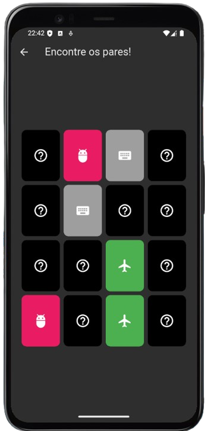
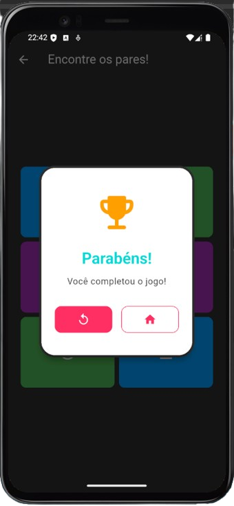

# Memory Game
Aplicativo de jogo da memória desenvolvido em Flutter. 

Encontre os pares o mais rápido possível e desafie sua memória visual! Suporte a diferentes níveis de dificuldade, para um desafio adaptado e divertido.


## Instalação

Siga as etapas abaixo para configurar e executar o projeto localmente:

### Pré-requisitos
Certifique-se de que você tenha o seguinte instalado:
- [Flutter SDK](https://docs.flutter.dev/get-started/install) (versão compatível com o projeto)
- [Android Studio](https://developer.android.com/studio) ou outro editor de sua preferência (opcional, mas recomendado)
- Emulador ou dispositivo físico conectado

### Passo 1: Clone o repositório
No terminal, execute:
```bash
git clone https://github.com/oJaciel/Memory-Game
cd Memory-Game
```

### Passo 2: Instale as dependências
Execute o comando:
```bash
flutter pub get
```

### Passo 3: Execute o projeto
Inicie o aplicativo com o comando:
```bash
flutter run
```

Certifique-se de que um dispositivo emulador ou físico esteja conectado para que o app seja executado.
## Capturas de Tela

### Tela inicial


### Seleção de dificuldade


### Tela do jogo


### Resultado

